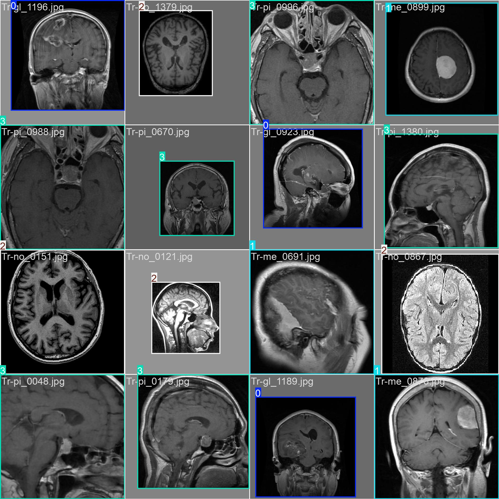

# Analysis of Brain MRI




This repository includes:
1) Custom convolutional network with 2 layers of detection and 1 dense layer
2) Code to train [resnet50 model](https://en.wikipedia.org/wiki/Residual_neural_network)
3) All dependencies that are needed to run fine tuning of YOLO model


Dependency manager: Conda
Intended code editor: Jupyter notebook


## Installation

To create conda environment out of `environment.yml`, please, execute (while in the root directory of the project):
```
conda env create -f environment.yml
```

To run the environment execute:

```

conda activate brain_mri
```

## Dataset

Please, [download](https://www.kaggle.com/datasets/masoudnickparvar/brain-tumor-mri-dataset/data) data set from Kaggle. Then create directory `dataset` in the root of the project. You should have the following structure:


```
/analysis-of-brain-mri
      |_dataset   
            |_Training
                 |_glioma
                 |_meningioma
                 |_notumor
                 |_pituitary
            |_Testing
                 |_glioma
                 |_meningioma
                 |_notumor
                 |_pituitary
            .
            .
            .
```

## Training and fine tuning models

* To train custom convolutional model and resnet50 use `training_custon_cnn_and_resnet50.ipynb
`
* To fine tune yolo use:
`yolo_labeling.ipynb` (it will generate special labels (directory `yolo_labels`) for images and put images aside to `yolo_images` directory). After generation of `yolo_labels` and `yolo_images`, put all images together in `yolo_images/Training` and yolo/Testing: so you have this structure:

```
/analysis-of-brain-mri
      |yolo_images   
            |_Training
                 |_<img1>
                 |_<img2>
                 |_<img3>
            |_Testing
                 |_<img1>
                 |_<img2>
                 |_<img3>
            .
            .
            .
```

then move all the labels (`yolo_lables`) to appropriate subdirectories in `yolo_images`. Note: labels should be on the same level with images (labels should be in one directory with images).
When generated, labels will have the following structure:
```
/analysis-of-brain-mri
      |_dataset   
            |_Training
                 |_glioma
                      |_label_for_glioma_image.txt
                      |_label_for_glioma_image.txt
                      |_label_for_glioma_image.txt
                 |_meningioma
                      |_label_for_meningioma_image.txt
                      |_label_for_meningioma_image.txt
                      |_label_for_meningioma_image.txt
                 |_notumor
                      |_label_for_notumor_image.txt
                      |_label_for_notumor_image.txt
                      |_label_for_notumor_image.txt
                 |_pituitary
                      |_label_for_pituitary_image.txt
                      |_label_for_pituitary_image.txt
                      |_label_for_pituitary_image.txt
            |_Testing
                 |_glioma
                      |_label_for_glioma_image.txt
                      |_label_for_glioma_image.txt
                      |_label_for_glioma_image.txt
                 |_meningioma
                 |_notumor
                 |_pituitary
            .
            .
            .
```


Please, move labels like this, so `glioma`, `meningioma`, `notumor`, `pituitary` are merged together both in `Training` and `Testing`:
```
/analysis-of-brain-mri
      |yolo_labels
            |_Training
                 |_label_for_img1.txt
                 |_label_for_img2.txt
                 |_label_for_img3.txt
            |_Testing
                 |_label_for_img1.txt
                 |_label_for_img2.txt
                 |_label_for_img3.txt

```

Then move labels from `yolo_labels/Training` to `yolo_images/Training` and from `yolo_labels/Testing` to `yolo_images/Testing`

 So, you should have the following structure:
```
/analysis-of-brain-mri
      |yolo_images   
            |_Training
                 |_<img1>
                 |_label_for_img1.txt
                 |_<img2>
                 |_label_for_img2.txt
                 |_<img3>
                 |_label_for_img3.txt
            |_Testing
                 |_<img1>
                 |_label_for_img1.txt
                 |_<img2>
                 |_label_for_img2.txt
                 |_<img3>
                 |_label_for_img3.txt
            .
            .
            .
```

Fine tune yolo with:

```
yolo task=detect mode=train model=yolov8n.pt data=yolo_data.yaml epochs=10 imgsz=640
```

then build predictions with new data using:

```
yolo task=detect mode=predict model=runs/detect/train/weights/best.pt source=<path to image>
```

or

```
yolo task=detect mode=predict model=runs/detect/train/weights/last.pt source=<path to image>
```

predictions will be saved to `./runs/detect/predict`

Enjoy coding!


